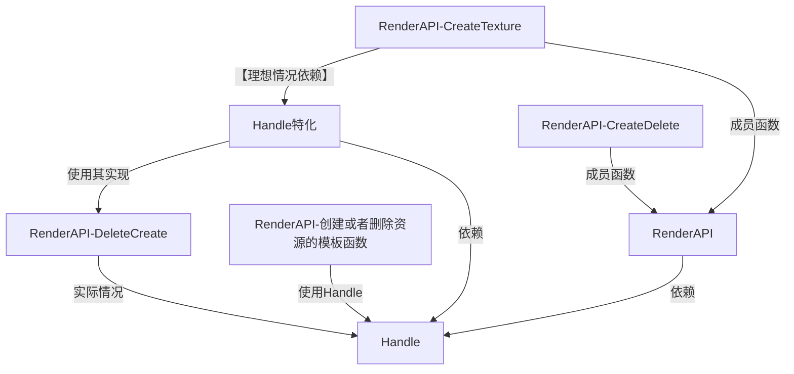
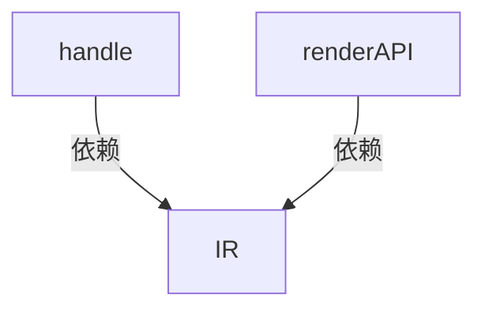

# Handle智能句柄设计
CaIEngine中使用引用计数器来实现GPU资源的回收，Handle设计为模版，作为管理资源对象的友元类，是用户可操作资源的唯一接口。

## Handle设计的基本依据
handle设计基本特点如下：
- 创建handle的代码有掌握资源池实现。
- handle的拷贝会导致资源池的引用计数加一
- handle是RAII的离开作用域析构会自动释放资源
- handle即是资源，操作handle方无法直接操作到底层资源（裸指针）

## Handle的实现细节以及改进思路
智能handle有多版本改进，最初想到要使用智能handle的原因是，运行时加载资源使用基础的index的话会出现ABA问题，所以为了克服这个问题使用引用计数解决，这里的引用计数是与资源的slot绑定的，相对于share_ptr，它是侵入式设计，所以这样设计的优点就是性能开销要小于shared_ptr，它可以尽可能的保证资源的连续性。
对于多线程的数据安全，这里只能保证资源池是线程安全的，此处使用的是读写锁去保护，因为GPU资源池的访问是远大于修改等操作。

### 实现问题
智能句柄的最初版本是希望使用偏特化实现对于资源提供方的匹配，但是这样操作会出现循环依赖问题

由上图可清晰见到，RenderAPI会像Handle这个通用实现去实例化，这和我们理想情况不同。其原因是我们再CreateTexture中对模板Handle进行实例化，编译器只能向前寻找模板实现。在模板函数中调用模板类然后没有传入特定类型，这会推迟模板实例化到传入具体类型。

### 解决方案
这里解决方法就是解耦合，引入有个模板类通过特化来存储Create和Delete。如下
```cpp
    //这个模板用来解除 ResourcePool拥有这和Handle创建拷贝等等
    template<typename T, typename Enable = void> //后面这个槽位用来实现SFINAE
    struct ResourceHandleTraits {
        static void Destroy(uint32_t index) {
            // Default behavior: do nothing
        }
        static uint32_t Copy(uint32_t index) {
            // Default behavior: just copy the index
            return index;
        }
    };
```
这样Handle中直接调用这个中间类
```cpp
    template<typename T>
    struct Handle {
        uint32_t index{UINT32_MAX}; //这里UINT32_MAX表示无效句柄,类似nullptr

        Handle() = default;

        ~Handle() {
            if (index != UINT32_MAX) {
                ResourceHandleTraits<T>::Destroy(index);
            }
        }

        Handle(const Handle& handle) {
            if (handle.index != UINT32_MAX) {
                index = ResourceHandleTraits<T>::Copy(handle.index);
            }
        }

        Handle& operator=(const Handle& handle) {
            if (this != &handle) {
                if (index != UINT32_MAX) {
                    ResourceHandleTraits<T>::Destroy(index);
                }
                if (handle.index != UINT32_MAX) {
                    index = ResourceHandleTraits<T>::Copy(handle.index);
                } else {
                    index = UINT32_MAX;
                }
            }
            return *this;
        }

        Handle(Handle&& handle) noexcept {
            index = handle.index;
            handle.index = UINT32_MAX;
        }

        Handle& operator=(Handle&& handle) noexcept {
            if (this != &handle) {
                if (index != UINT32_MAX) {
                    ResourceHandleTraits<T>::Destroy(index);
                }
                index = handle.index;
                handle.index = UINT32_MAX;
            }
            return *this;
        }
    };
```

然后只需要再RenderAPI下方直接去特化上面的中间类型即可实现解耦合。



## 总结
这个设计不是过度优化，而是为了后续的热更提供基础。
