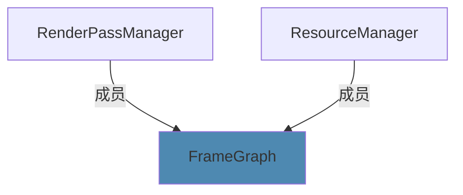

# FrameGraph

FrameGraph 这个结构将渲染的流程通过有向无环图描述出来，由此可以获得其拓扑关系。对于得到的拓扑结构，我们可以轻松的知道Pass和Pass、Pass和Resource与Resource和Resource之间依赖关系，进而推导插入合适的Barrier，实现资源别名，减少资源利用率。当然其功能远不于此，FrameGraph还可以实现Pass的重排，Pass的合并（合并到有个SubPass来提高移动端的性能），本代码中并未使用此架构。

## 概述

本FrameGraph分为三个模块。 1. ResourceManager 2. RenderPassManager 3. FrameGraph . 这三者的依赖关系如下图：



## ResourceManager

ResourceManager主要是用来管理FrameGraph中的资源核心要点是对于资源的描述。

### 资源抽象
这里的抽象分为两层
- 第一层是根据资源本身的性质所构成的
- 第二层是根据资源在FrameGraph中的性质

第一层使用了继承的方式，资源本身的种类大致由texture 和 buffer这两种组成，再细节的区分由两者的参数所决定，比如3D、Cube、2D纹理的区别。
第二层中包含了资源在FrameGraph中的属性，比如其在由哪个Pass产生以及被哪些Pass消费，当然外界的资源比如Swapchain等等要做额外的标记。资源也要包含时间线信息，用来支持后续的资源别名操作。


## RenderPass

renderPass的抽象很简单，大体由一下部分组成
- RenderPass中需要执行的操作
- RenderPass前后的依赖关系
- RenderPass中前后的Barrier信息

### 执行操作
对于执行器，这里为了开发的便捷性并没有使用上下文结构体来存储上下文信息，这样相对于`std::fuction<>`通用类型擦除有更高的性能和更好的优化空间，这里为了快速实现，暂时还是使用`std::fuctiion<>` 。

### Barrier信息
Barrier信息，这里使用了`vkCmdPipelineBarrier` 这个函数是的接口，需要传入在此函数内传入stageMask，对于新版本的接口，stageMask只需要存入DependencyInfo显示的上传即可。（并且新的接口似乎可以插入到RenderPass实例中）。
TODO：后续需要修改为新接口。


## FrameGraph

此结构管理着整个frameGraph的运行，其主要分为两个阶段——1. 编译 2.运行。这两个阶段中编译器最耗时。

### Compiling阶段
此阶段分为以下操作
```cpp
FG::FrameGraph &FG::FrameGraph::Compile() {
    usingResourceNodes.clear();
    usingPassNodes.clear();
    timeline.clear();
    //清理别名系统
    resourceManager.ClearAliasGroups();
    CullPassAndResource();
    CreateTimeline();
    CreateAliasGroups();
    InsertBarriers2();
    CreateCommandPools();
    return *this;
}
```

特别的上述没有清理RenderPassManager和ResourceManager中的node的原因是因为，真正使用的resourceNode在usingResourceNodes中，真正使用的renderPassNode在usingRenderPassNodes中。


### Exec阶段
此阶段就是进行命令录制。frameGraph天生的优势就是可以并行录制各个pass，然后根据得到的timeline串行的提交。当然在提交时要将Barrier插入，为了减少FrameBufffer和RenderPass的组合爆炸，此模型使用了dynamic Rendering。


## 总结
大致流程如上 。
